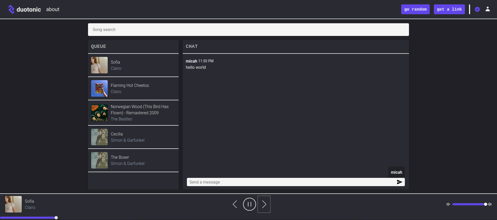
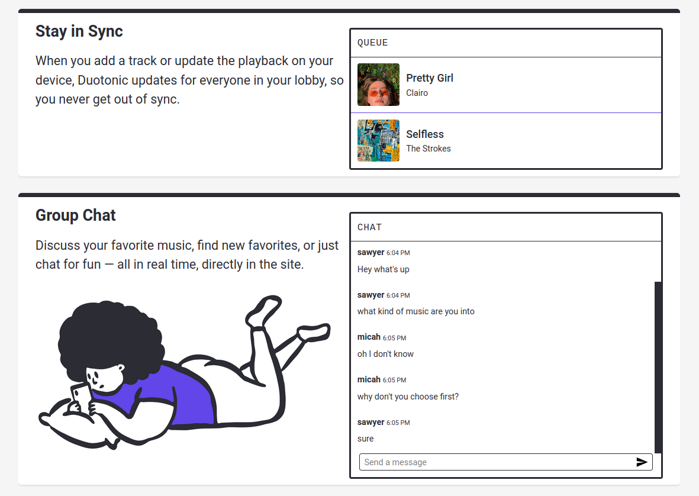

# Duotonic

### Listen to Spotify and chat simultaneously with a friend or stranger.
 

 

## Overview

**Duotonic** is a full stack web application that sits on top of the Spotify API and allows *Preimum* users to control their playback and queue together.

The application employs a React/Gatsby frontend and a Node.js (Hapi framework) and MongoDB backend. The entire app can be found in the repo, with the frontend in `client/app` and the backend in `server`. Additionally there is a Gatsby landing page for the site at `client/home`.

Users listening in the same *room* (sharing a valid room query parameter in their URL) are connected via websockets to pub/sub updates that keep their playback in sync. The websockets also communicate chat messages to users in the same room. There is currently no limit on the number of users that may be in one room at once.

Rooms can be joined either by sharing the URL with the room query parameter, or by joining the *queue*, which will match the first two users waiting in queue and create a new room for them.

Users on Chromium-based or Firefox desktop browsers can listen directly through their browser using the Spotify Web Playback SDK. On mobile and unsupported desktop browsers, users must open the Spotify app on their phone or another device, which Duotonic will automatically connect to.

## Contributing

The site has numerous bugs and inconsistancies, so pull requests and issues are welcome on both the client and server side. There are also currently 0 unit tests, so any work on writing or setting up a testing system would be very useful.